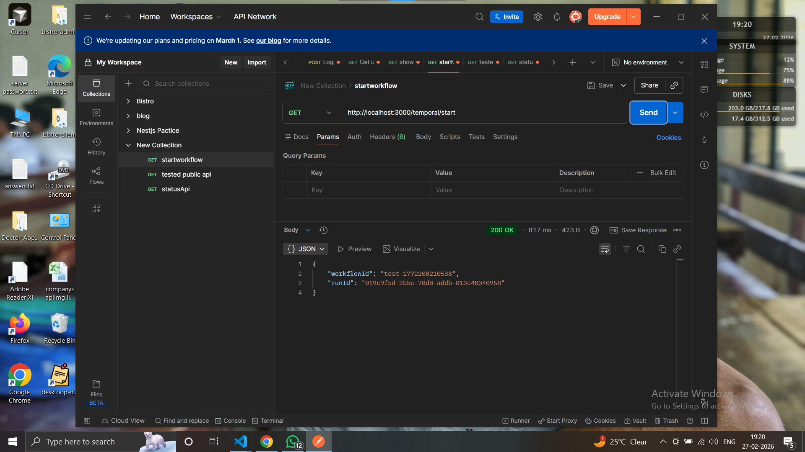
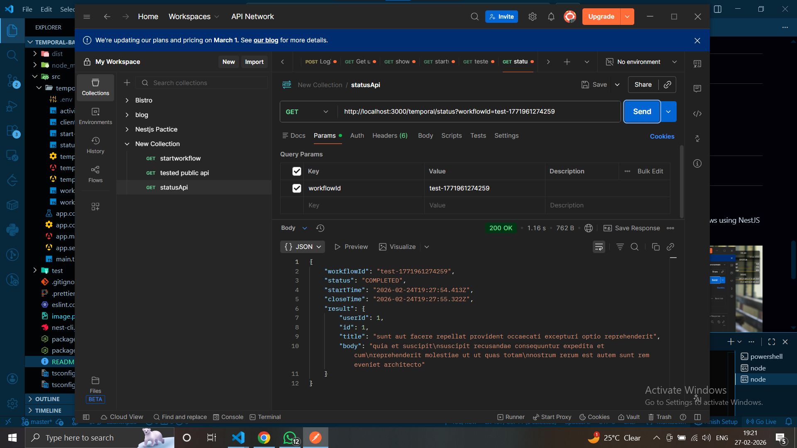
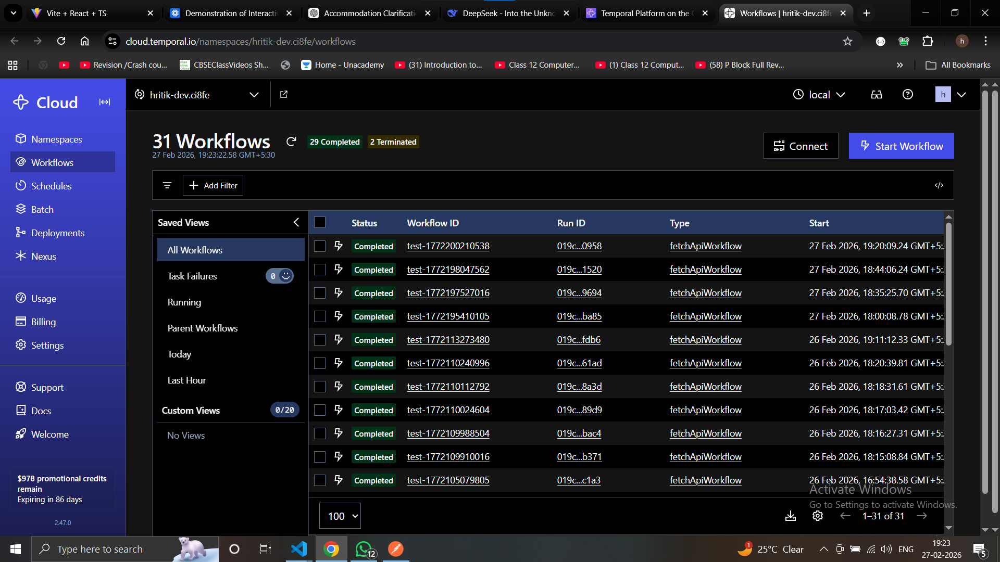

# Temporal Backend (NestJS + Temporal Cloud)

This project is a backend service built with **NestJS** and **Temporal**.  
It demonstrates how to start workflows, execute activities, and poll workflow status using **Temporal Cloud**.

The backend is designed to work with a React frontend that triggers workflows and displays execution results.

---

## Tech Stack

- Node.js  
- NestJS  
- TypeScript  
- Temporal Cloud  
- @temporalio/client  
- @temporalio/worker  

---

---

## Temporal Cloud Setup

1. Create an account on Temporal Cloud  
2. Create a Namespace  
3. Download mTLS certificates  
4. Note the following:
   - Namespace  
   - Temporal Cloud endpoint  
   - Certificate paths  

---

## Environment Variables

Create a `.env` file in the project root:
EMPORAL_NAMESPACE=your-namespace
TEMPORAL_ADDRESS=your-cloud-endpoint
TEMPORAL_CERT_PATH=./certs/client.pem
TEMPORAL_KEY_PATH=./certs/client.key

⚠️ Do not commit `.env` or certificate files to Git.

---

## How to Run the Project

Follow the steps below **in the given order**.

### 1. Install Dependencies
npm install

---

### 2. Start Temporal Worker

The worker must be running before starting the backend server.

npm run worker

Keep this terminal running.

---

### 3. Start Backend Server

Open a new terminal and run:

npm run dev
---

### The backend server will start at: http://localhost:3000

---

## API Endpoints

### Start Workflow

**POST** `/workflow/start`

Response:

{
"workflowId": "workflow-12345"
}

---

### Get Workflow Status

**GET** `/workflow/status/:workflowId`

Response:
{
"status": "COMPLETED",
"result": {
"userId": 1,
"id": 1,
"title": "sample title",
"body": "sample body"
}
}

Possible status values:

- RUNNING  
- COMPLETED  
- FAILED  

---

## Workflow Execution Flow

1. Frontend calls Start Workflow API  
2. Backend creates a Temporal workflow  
3. Worker executes workflow and activities  
4. Frontend polls Status API  
5. Result is returned when workflow completes  

---

## Testing

You can test the APIs using:

- Postman  
- cURL  
- React frontend  

---

## Common Issues

### Worker connected but workflow not running

- Ensure worker is running  
- Verify task queue name  
- Check namespace configuration  

### Client cannot connect to Temporal Cloud

- Verify certificate paths  
- Check Temporal Cloud endpoint  
- Confirm environment variables are loaded  

---

## Notes

- Environment variables were temporarily hardcoded during development due to loading issues  
- Workflow execution is asynchronous  
- Polling is used instead of webhooks  

---

## Future Improvements

- Workflow cancellation API  
- Retry and timeout policies  
- Persist workflow metadata in database  
- Webhook-based status updates  
- Authentication and authorization  

---

## Author

**Hritik Mittal**

Built as part of learning and implementing Temporal workflows using NestJS and Temporal Cloud.

Note: Environment variables are hardcoded temporarily because .env was not loading correctly.

Loom Video link
https://www.loom.com/share/44851fa797b4487a9a9c3e345e9797ca

